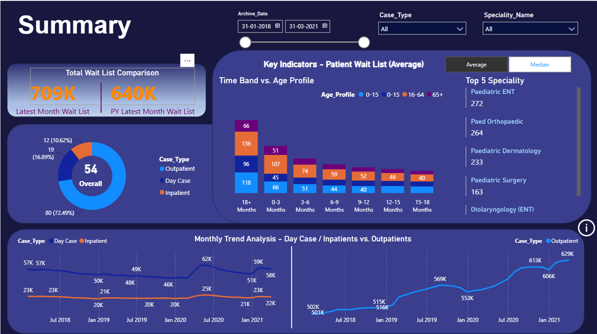
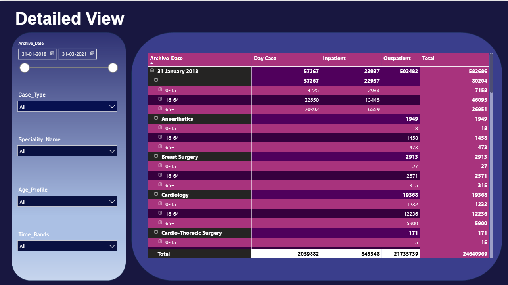

# Healthcare Patient Wait List Analysis Dashboard

## Project Overview

This project analyzes healthcare patient wait list data using Power BI. The dashboard provides insights into patient wait times across different specialties, age groups, case types, and time bands.

The goal of the project is to help healthcare stakeholders monitor wait list trends, identify bottlenecks, and support data-driven decision-making.

---

## Dashboard Features

### Summary View

- Total Wait List Comparison
- Latest Month Wait List vs Previous Year Wait List
- Case Type Distribution
- Time Band vs Age Profile Analysis
- Top 5 Specialties by Wait List
- Monthly Trend Analysis

### Detailed View

- Interactive filtering
- Drill-down matrix analysis
- Specialty-wise breakdown
- Age Profile analysis
- Time Band analysis
- Case Type filtering

---

## Tools & Technologies

- Power BI Desktop
- Power Query
- DAX
- Data Modeling
- Interactive Slicers
- Matrix Visuals
- KPI Cards
- Donut Charts
- Stacked Bar Charts
- Line Charts

---

## Key Insights

- Outpatient cases contribute the largest share of the patient wait list.
- Certain specialties consistently show higher waiting times.
- Wait list patterns vary significantly across age groups.
- Monthly trends help identify periods of increased patient demand.

---

## Skills Demonstrated

- Data Cleaning
- Data Transformation
- Data Modeling
- DAX Measure Creation
- Dashboard Design
- Data Visualization
- Business Intelligence Reporting
- Analytical Thinking

---

## Project Screenshots

### Summary Dashboard

### Detailed Dashboard

---

## Files Included

- Healthcare_Waitlist_Dashboard.pbix
- Dashboard Screenshots
- README.md

---

## Author

Ramya Ravikumar

Data Analyst | Power BI | SQL | Python | Machine Learning

LinkedIn: https://www.linkedin.com/in/ramya-r1811/

GitHub: https://github.com/ramya-ravikumar-r
